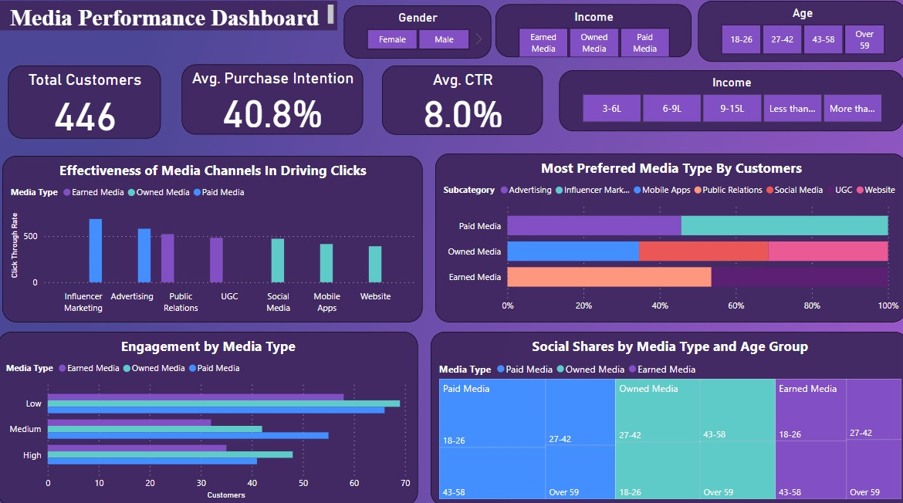
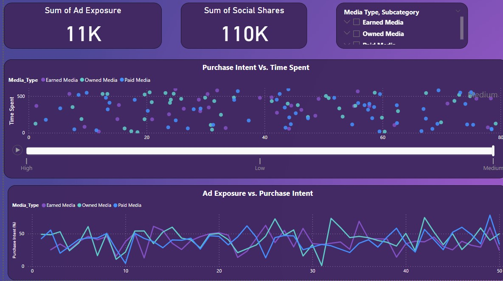
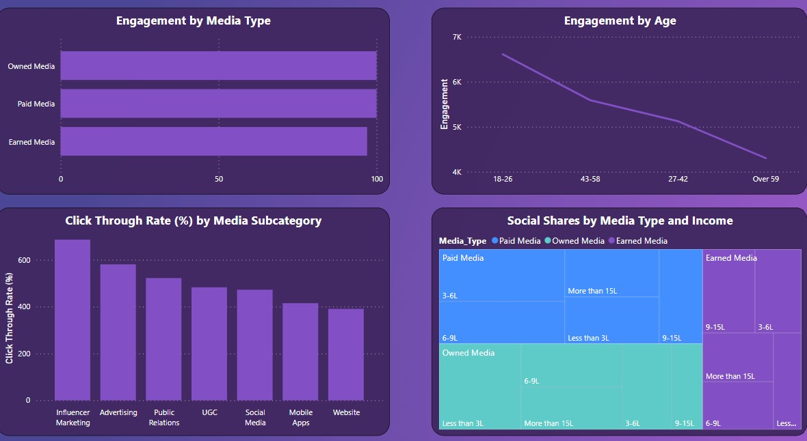

#Media Preferences Analysis (Paid, Owned, Earned)

###Dashboard Link: https://app.powerbi.com/links/N6ScI5pMwh?ctid=b868613f-a153-49ec-a06e-990b12559e5f&pbi_source=linkShare

## Problem Statement
Understanding customer engagement across different Paid, Owned, and Earned (POEM) media channels is essential for optimizing marketing strategies. This dashboard helps businesses analyze click-through rates, engagement scores, purchase intent, ad exposure, social shares, and time spent, segmented by customer demographics.
Through this analysis, businesses can:
-	Identify which media types and subcategories are most effective for different customer groups.
-	Optimize marketing investments based on engagement and conversion trends.
-	Improve targeting by analyzing customer behavior across media channels.

## Steps followed
-	Step 1: Loaded dataset into Power BI Desktop (CSV format).
-	Step 2: Opened Power Query Editor and enabled "Column distribution," "Column quality," and "Column profile" under the View tab.
-	Step 3: Set "Column profiling based on the entire dataset" to analyze data quality.
-	Step 4: Identified missing values in the dataset and handled them using data transformation techniques.
-	Step 5: Created calculated columns to categorize data:
    -   Age Group: 18-26, 27-42, 43-58, Over 59
    -	Income Level: Less than 3L, 3-6L, 6-9L, 9-15L, More than 15L
    -	Engagement Score Ranges: Low (1-33), Medium (34-66), High (67-100)
-	Step 6: Applied data modeling to create relationships between customer demographics and media engagement metrics.
-	Step 7: Designed the dashboard layout using Power BI Visualizations.
-	Step 8: Added interactive slicers for filtering by Age, Gender, Income, Media Type, and Subcategory.
-	Step 9: Created DAX measures for:
    -  	Total Click-Through Rate (CTR)
    -	Average Engagement Score
    -	Purchase Intent (%)
    -	Total Ad Exposures & Social Shares
-	Step 10: Implemented interactive tooltips and drill-through pages for deeper analysis.
-	Step 11: Published the report to Power BI Service for real-time access and sharing.

## Dashboard Pages & Visualizations
### Page 1: Overview & Key Metrics
This page provides a high-level summary of customer engagement and demographics.
-	Card Visuals: Display key metrics like Total Customers, Average Click-Through Rate, Average Purchase Intent, and Engagement Score.
-	Slicers: Allow users to filter data by Age Group, Gender, Income, Media Type, and Subcategory.
-	Stacked Bar Chart: Shows Engagement Score by Media Type to compare Paid, Owned, and Earned media effectiveness.
-	Pie Chart: Visualizes customer demographics, such as the percentage of users in each age group or gender segment.
### Page 2: Media Performance Analysis
This page helps understand which media channels drive higher customer engagement and conversions.

### Page 3: Consumer Behavior Insights
This page provides deeper insights into how customers interact with different media types.

### Key Insights & Findings
Paid Media (Advertising & Influencer Marketing):
-	Influencer marketing drives higher engagement but lower CTR compared to traditional ads.
-	Younger users (18-26) show higher engagement with influencer marketing.
Owned Media (Websites, Social Media, Mobile Apps):
-	Websites generate higher purchase intent, but engagement is lower than social media.
-	Mobile apps have higher time spent per session but lower CTR.
Earned Media (User-Generated Content & Public Relations):
-	UGC has the highest engagement score across all media types.
-	Public Relations efforts perform better among older demographics (43+ age group).
Customer Behavior Trends:
-	Higher-income groups (9L-15L+) engage more with Owned Media (Web & Apps).
-	Engagement Score and Purchase Intent show a strong correlation in scatter plot analysis.

### Snapshots of the Dashboard

📍 Overview Page
 
📍 Media Performance
  
📍 Consumer Insights

________________________________________
### Conclusion

This Power BI Dashboard provides data-driven insights into customer preferences across Paid, Owned, and Earned Media Channels. By analyzing click-through rates, engagement scores, and purchase intent, businesses can optimize marketing strategies and maximize return on investment (ROI). 🚀

